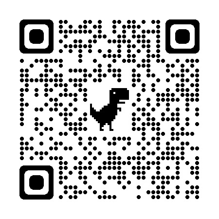
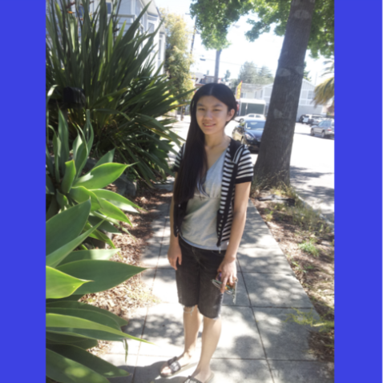

# Square a Cat

Square a Cat is a cat who aspires to connect the world by giving back your photos all in perfect squares 🎆🌁🎑🩻.

A thousand words saved, squared images are good for Instagram, whose carousel doesn't want to resize.
Square a Cat is created specifically for squaring images for Instagram.
It gives your images back in squares with padded background of your chosen color.
It also gives your images in the resolution that directly corresponds to IG's consumption.
So the images are feather light.

Visit Square a Cat on your phone via this QR code:

Square a Cat works offline! Have Meow live in your phone by adding it to home screen and get your photos squared in the great outdoors.

## More stories

Square a Cat's creator, Wei, has a climbing partner who likes to take photos of others when climbing.
One day during their regular bus rides from KL back to SG, the OCD friend scratches his head and asked if he could "add a border" to photos.
After some questions to understand what the "border" was referring to, Wei realized that her climbing partner wants his photos in squares so they can make Instagram happy.

Wei has been a web front end engineer for years and believes that there must be an app specifically for this purpose.
After a few rounds of searches, the apps she found either ask for $$$ or are spammed with lots of ads.
They're not cool.
So she decided to build one herself.

**Wei in a blue square**

